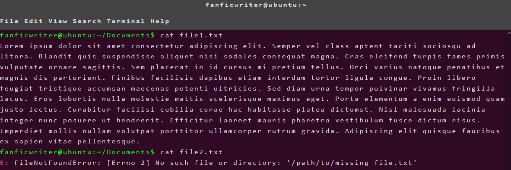
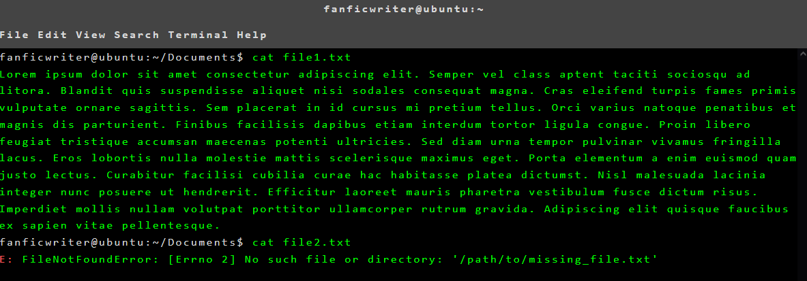

# Linux Terminal in your fanfic

This is my first project in CSS - to get familiar with it and contribute to the community. 
How to use this skin: 

1) Learn how to apply a workskin to your fic 

2) In the HTML section of thw work text, include: 

    ```<div class="terminalHeading">

    <p>USERNAME@SYSTEMNAME:~</p></div>

    <div class="terminalMenu">

    <p>File Edit View Search Terminal Help</p></div>

    <div class="terminalBody">

        <p class="command">TYPE COMMANDS HERE</p>

        <p class="output">TYPE OUTPUT HERE</p>

        <p class="cmd_error">TYPE ERRORS HERE</p>
    </div>

3) Important: to change the USERNAME@SYSTEMNAME and path info displayed in the terminal, you have to edit the CSS code: 

    ```#workskin p.command::before {
        content: "USERNAME@SYSTEMNAME:~/PATH$ ";
        color: #0f0;
    }

4) Feel free to edit, improve and modify the code




